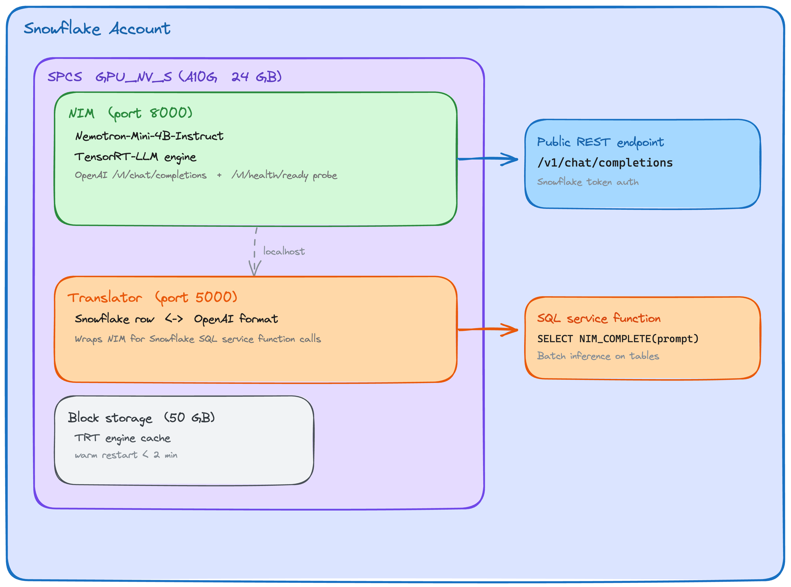

# NVIDIA Nemotron-Mini-4B on Snowpark Container Services

Deploy **Nemotron-Mini-4B-Instruct** inside Snowflake using NVIDIA's production-grade NIM inference engine — no data leaves your account perimeter.



> Source: [`img/architecture.excalidraw`](img/architecture.excalidraw) — open in [Excalidraw](https://excalidraw.com) to edit.

**Why NIM instead of Ollama or vLLM directly?**

| | NIM | Ollama |
|---|---|---|
| Inference optimization | TensorRT-LLM (max GPU throughput) | None |
| API compatibility | OpenAI `/v1/chat/completions` | OpenAI-compatible |
| Readiness probes | `/v1/health/ready` (SPCS-native) | Manual |
| LoRA adapter support | Hot-swap without rebuild | No |
| Production grade | Yes (NVIDIA AI Enterprise) | No |

---

## Prerequisites

| Requirement | Notes |
|---|---|
| Snowflake account with SPCS enabled | Contact your account team if SPCS is not available in your region |
| Role with `CREATE COMPUTE POOL`, `SYSADMIN` | `ACCOUNTADMIN` works |
| Docker Desktop (linux/amd64 buildx) | Required to pull/push images |
| `snow` CLI installed | `pip install snowflake-cli-labs` |
| NVIDIA NGC account + API key | Free — see below |

---

## Step 0: Get an NVIDIA NGC API Key

1. Create a free account at **https://ngc.nvidia.com** (click "Sign Up")
2. Navigate to **Org** → **Setup** → **API Keys** → **Generate API Key**
3. Copy the key (starts with `nvapi-`)
4. Export it in your shell: `export NGC_API_KEY="nvapi-xxxxxxxxxxxx"`

The key is used to:
- Pull the `model-free-nim` container from `nvcr.io` (Step 2)
- Authenticate NIM at runtime for licensing/telemetry (injected as a Snowflake Secret)

---

## Deployment Walkthrough

### Step 1: Snowflake Infrastructure

Open a Snowflake worksheet and run **`build/setup/01_snowflake_setup.sql`**.

This creates:
- `NEMOTRON_DB.NEMOTRON_SCHEMA` — database and schema
- `NEMOTRON_REPO` — image repository (Snowflake's container registry)
- `NEMOTRON_GPU_POOL` — `GPU_NV_S` compute pool (1× A10G, 24 GB VRAM)
- `NGC_API_KEY` — Snowflake Secret (**fill in your real key after running**)
- `NGC_NETWORK_RULE` + `NGC_ACCESS` — egress to NVIDIA/HuggingFace for weight downloads

> After running the script, **update the NGC secret** with your real key:
> ```sql
> ALTER SECRET NEMOTRON_DB.NEMOTRON_SCHEMA.NGC_API_KEY
>     SET SECRET_STRING = 'nvapi-your-real-key-here';
> ```

Wait for the compute pool to reach `IDLE` state before continuing:
```sql
DESCRIBE COMPUTE POOL NEMOTRON_GPU_POOL;
```

### Step 2: Build & Push Container Images

```bash
export NGC_API_KEY="nvapi-xxxxxxxxxxxx"
export SNOW_CONNECTION="your-connection-name"   # matches ~/.snowflake/connections.toml

bash build/scripts/push_images.sh
```

This script:
1. Pulls `nvcr.io/nim/nvidia/model-free-nim:latest` (linux/amd64)
2. Pushes it to your Snowflake image repository
3. Builds the Flask translator sidecar from `build/docker/translator/`
4. Pushes the translator image
5. Uploads `build/service-spec.yaml` to `@NEMOTRON_STAGE`

> First pull of the NIM image is ~10 GB. Subsequent runs skip the pull if already cached locally.

### Step 3: Deploy the Service

Run **`build/setup/02_deploy_service.sql`** in Snowflake.

This creates:
- `NEMOTRON_SERVICE` — the two-container SPCS service
- `NIM_COMPLETE(prompt TEXT)` — SQL service function

**First cold start takes 5–15 minutes** while NIM:
1. Downloads `nvidia/Nemotron-Mini-4B-Instruct` weights from HuggingFace (~8 GB)
2. Compiles a TensorRT-LLM engine tuned for the A10G

Monitor status:
```sql
SELECT SYSTEM$GET_SERVICE_STATUS('NEMOTRON_DB.NEMOTRON_SCHEMA.NEMOTRON_SERVICE');
```

### Step 4: Run the Demo Notebook

Upload `src/notebooks/nemotron_demo.ipynb` to Snowflake Notebooks:

1. In Snowsight: **Projects → Notebooks → + Notebook → Import .ipynb**
2. Select warehouse (any size — the notebook makes REST/SQL calls, no heavy compute needed)
3. Click **Run All**

Or run locally (see [Local Development](#local-development-uv) below).

---

## Demo Operations / Pre-Meeting Checklist

This service is GPU-backed — keep the compute pool **suspended** when not in use and wake it just before a demo to avoid unnecessary billing.

### One-time setup (do this once)

Complete Steps 1–4 above. After the smoke test passes, verify everything looks good, then suspend:

```sql
ALTER COMPUTE POOL NEMOTRON_GPU_POOL SUSPEND;
```

### Before the meeting (can do hours or days in advance)

Resume the service and confirm it reaches READY before the meeting starts:

```sql
-- Run build/setup/03_resume.sql, or paste these directly:
USE SCHEMA NEMOTRON_DB.NEMOTRON_SCHEMA;

-- 1. Resume compute pool first (service depends on it)
ALTER COMPUTE POOL NEMOTRON_GPU_POOL RESUME;
ALTER SERVICE NEMOTRON_SERVICE RESUME;

-- 2. Poll until both show READY (warm restart with cached TRT engine: ~2 min)
SELECT SYSTEM$GET_SERVICE_STATUS('NEMOTRON_DB.NEMOTRON_SCHEMA.NEMOTRON_SERVICE');

-- 3. Quick smoke test
SELECT NIM_COMPLETE('In one sentence, what is Snowpark Container Services?');
```

Once the smoke test returns a real answer, suspend again if the meeting is still hours away:

```sql
ALTER COMPUTE POOL NEMOTRON_GPU_POOL SUSPEND;
```

### When the customer arrives

```sql
-- Wake up (~2 min, cached engine — no weight re-download)
ALTER COMPUTE POOL NEMOTRON_GPU_POOL RESUME;
ALTER SERVICE NEMOTRON_SERVICE RESUME;

-- Confirm status before switching to the demo
SELECT SYSTEM$GET_SERVICE_STATUS('NEMOTRON_DB.NEMOTRON_SCHEMA.NEMOTRON_SERVICE');
```

### After the meeting

```sql
ALTER COMPUTE POOL NEMOTRON_GPU_POOL SUSPEND;
```

---

## Usage

### SQL

```sql
-- Single prompt
SELECT NIM_COMPLETE('Summarize the benefits of running LLMs inside Snowflake.');

-- Batch inference on a table
SELECT
    customer_id,
    NIM_COMPLETE('Classify this feedback as Positive/Negative/Neutral: ' || feedback_text) AS sentiment
FROM customer_feedback
LIMIT 100;
```

### Python (OpenAI SDK)

```python
import snowflake.connector
from openai import OpenAI

conn = snowflake.connector.connect(connection_name="your-connection")
token = conn._rest._token_request("ISSUE")["data"]["sessionToken"]

client = OpenAI(
    base_url="https://<your-nim-ingress-url>/v1",
    api_key="not-used",
    default_headers={"Authorization": f'Snowflake Token="{token}"'},
)

response = client.chat.completions.create(
    model="ga-model-free-nim",
    messages=[{"role": "user", "content": "What is Nemotron?"}],
    max_tokens=512,
)
print(response.choices[0].message.content)
```

Get the ingress URL with:
```sql
SHOW ENDPOINTS IN SERVICE NEMOTRON_DB.NEMOTRON_SCHEMA.NEMOTRON_SERVICE;
```

---

## Local Development (uv)

[uv](https://docs.astral.sh/uv/) manages the Python environment and dependencies.

```bash
# Install dependencies (creates .venv/ automatically)
uv sync

# Install with dev tools (pytest etc.)
uv sync --group dev

# Launch JupyterLab to run the demo notebook locally
uv run jupyter lab src/notebooks/nemotron_demo.ipynb
```

The notebook auto-detects whether it's running inside Snowflake Notebooks or locally.
For local runs it uses `CONNECTION_NAME` (edit cell 2) to connect via `~/.snowflake/connections.toml`.

### Running the end-to-end tests

Tests require the service to be in `RUNNING` state.

```bash
SNOW_CONNECTION=<your-connection-name> uv run pytest src/tests/ -v
```

Expected output when all pass:

```
test_compute_pool_ready       PASSED
test_service_running          PASSED
test_containers_ready         PASSED
test_endpoints_registered     PASSED
test_smoke_inference          PASSED
test_multi_prompt_inference   PASSED
test_batch_on_table           PASSED
test_model_name_in_logs       PASSED
```

---

## File Structure

```
├── build/
│   ├── docker/
│   │   └── translator/
│   │       ├── translator.py         # Flask sidecar: Snowflake rows ↔ OpenAI format
│   │       ├── Dockerfile
│   │       └── requirements.txt
│   ├── setup/
│   │   ├── 01_snowflake_setup.sql    # Infrastructure (run first)
│   │   ├── 02_deploy_service.sql     # Service + SQL function (run after image push)
│   │   └── 03_resume.sql             # Resume after suspension
│   ├── scripts/
│   │   └── push_images.sh            # Pull NIM, build translator, push both
│   └── service-spec.yaml             # SPCS two-container service specification
├── src/
│   ├── notebooks/
│   │   └── nemotron_demo.ipynb       # Demo: status check → Python REST → SQL → batch
│   └── tests/
│       ├── conftest.py               # Pytest fixture (Snowflake connection)
│       ├── test_e2e.py               # End-to-end tests (T-01 through T-08)
│       └── TEST_PLAN.md              # Human-readable test documentation
├── img/
│   └── architecture.png
├── pyproject.toml                    # uv/Python project config
└── README.md
```

---

## Cost & Operations

```sql
-- Suspend GPU pool when not in use (stops billing)
ALTER COMPUTE POOL NEMOTRON_GPU_POOL SUSPEND;

-- Resume when needed
ALTER COMPUTE POOL NEMOTRON_GPU_POOL RESUME;
```

- `GPU_NV_S` (1× A10G) bills per second while `ACTIVE`
- `AUTO_SUSPEND_SECS = 1800` auto-suspends after 30 minutes idle
- Block storage (50 GB) caches the compiled TRT engine — warm restarts take < 2 min
- Model weights: ~8 GB BF16 — well within A10G's 24 GB VRAM

---

## Security

- Inference traffic never leaves your Snowflake account
- NVIDIA/HuggingFace egress is limited to **weight download only** (first boot)
- Access is controlled by Snowflake RBAC via `GRANT SERVICE ROLE`
- The NGC API key is stored as a Snowflake Secret (never in code or logs)

> **Before publishing this repo publicly:** clear notebook cell outputs to remove any saved
> account URLs or usernames. Run `jupyter nbconvert --ClearOutputPreprocessor.enabled=True
> --inplace src/notebooks/nemotron_demo.ipynb` or clear outputs manually in Snowsight.

---

## Resources

- [NVIDIA NIM Documentation](https://docs.nvidia.com/nim/)
- [Model-Free NIM Guide](https://docs.nvidia.com/nim/large-language-models/latest/model-free-nim.html)
- [Snowpark Container Services Docs](https://docs.snowflake.com/en/developer-guide/snowpark-container-services/overview)
- [Nemotron-Mini-4B on HuggingFace](https://huggingface.co/nvidia/Nemotron-Mini-4B-Instruct)
- [Snowflake + NVIDIA Developer Guide](https://www.snowflake.com/en/developers/guides/build-custom-llm-apps-with-snowpark-container-services-and-nvidia/)
